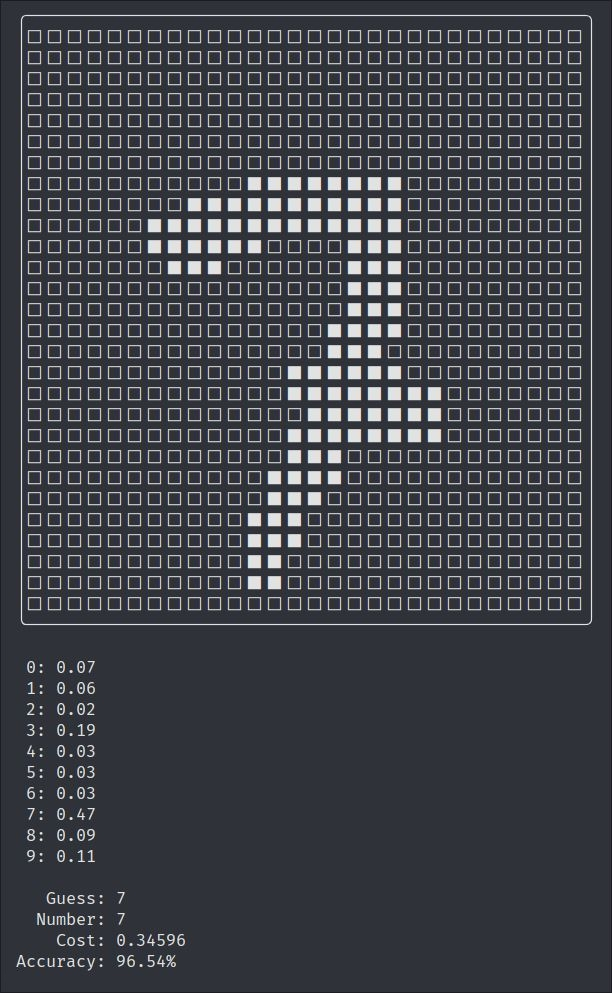

# Digit guesser 
The project is a rust implementation of guessing hand-written digits using a deep learning algorithm, with the help of the [MNIST database](http://yann.lecun.com/exdb/mnist/).
It has been heavily inspired by [3Blue1Brown's video](https://www.youtube.com/watch?v=aircAruvnKk) introduction to deep learning.




# Running
1. Install [rust](https://www.rust-lang.org/)
2. Clone this repository
```
git clone https://github.com/jookzie/digit-guesser-rs.git --depth=1
cd digit-guesser-rs
```
3. Run the project
```
cargo run --release
```

# Progress
- [x] Parse database files
- [x] Train model
- [x] Test model
- [ ] Command line interface
- [ ] Serialize/deseralize model
- [ ] Multi-threading

# Status
So far, the trained models manage to guess the digits 36% of the time.
Most likely the backprop is subpar and needs optimizations.

P.S. I have not had any AI courses, this is purely an attempt to learn rust and deep learning.
